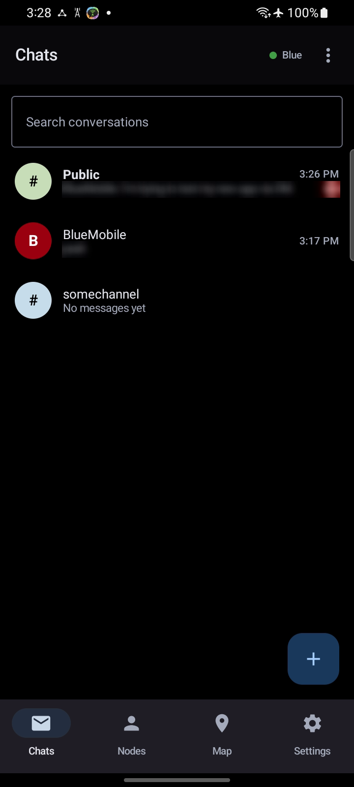
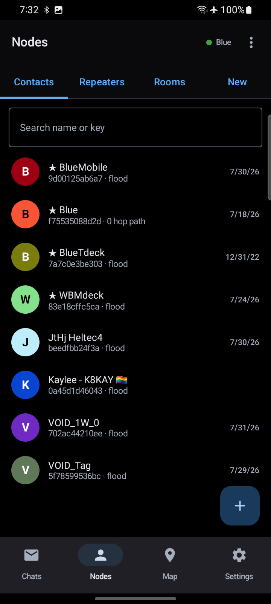
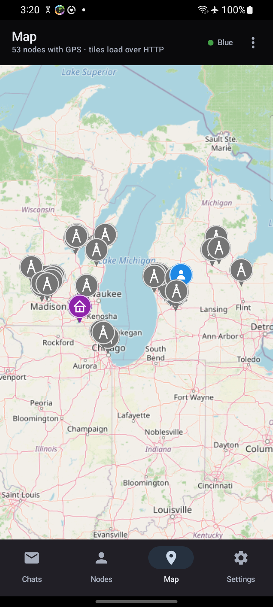
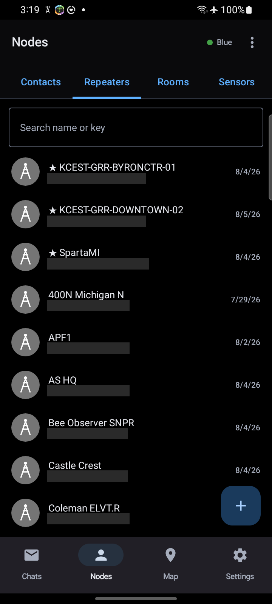
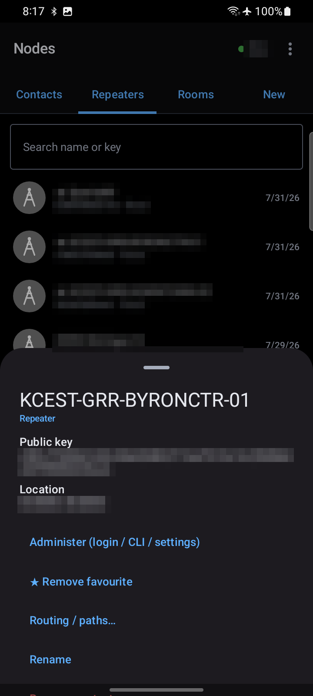
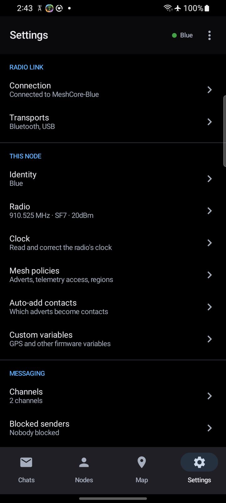

# MeshCore Hardened (MCH)

*A hardened, minimal [MeshCore](https://meshcore.co.uk/) client for Android — off-grid
encrypted messaging over LoRa, with no servers, no accounts, and no app-store lock-in.*

**Not affiliated with the official MeshCore app.** This is an independent third-party client;
"Hardened" refers to this build's posture (small attack surface, keystore-sealed secrets,
encrypted local storage) — not to any change in the MeshCore protocol's own guarantees.

**On the name.** The app is **MeshCore Hardened**; **MCH** is shorthand, used below and in
conversation. The full name is what ships — the launcher, the releases and the app itself all
say MeshCore Hardened, and the word doing the work there is *Hardened*, which is a claim about
this build that the [security posture](#security-posture) section qualifies. Worth knowing if
you go looking: **MCH** on its own is a crowded acronym (it is mostly a blood-test value), so
searching for it will not find this. Search for MeshCore Hardened.

MCH is a native Kotlin Multiplatform client for the MeshCore mesh, built in the mold of its sibling
[reticulum-mobile-app](https://github.com/thatSFguy/reticulum-mobile-app): a real native app —
foreground service for a persistent radio link, system notifications on incoming messages — with
the smallest attack surface I can keep secure and reason about.

**No external dependencies.** No accounts, no API keys, no central server, no analytics, no Google
Play Services, no Firebase. All crypto runs locally; secrets live in the Android Keystore;
persistence is Room (SQLite). The **only** outbound HTTP the app ever makes is OpenStreetMap tile
fetches on the Map tab — everything else is MeshCore frames over the transport you attach
(BLE / USB, or TCP if you deliberately turn it on).

[](https://github.com/thatSFguy/meshcore-mobile-app/releases/latest)
[](https://github.com/thatSFguy/meshcore-mobile-app/actions/workflows/android-ci.yml)
[](LICENSE)

## Project scope — personal app, shared in the open

MCH is a **personal app, released in the open**. It does what I need an off-grid MeshCore client
to do, and it is deliberately **closed to new feature requests**. The goal is the opposite of feature
growth: the smallest, most static attack surface I can keep secure and reason about. You are very
welcome to:

- **Use it** — install the signed APK, attach your own MeshCore radio over BLE or USB, and message
  people. No account, no server, no telemetry.
- **Fork it** — it's [AGPL-3.0](LICENSE). Build your own version with whatever features you want;
  that's what the licence is for.
- **Report security issues** — see **[SECURITY.md](SECURITY.md)**. Vulnerability reports are the
  one kind of report I actively want; please report privately rather than opening a public issue.
- **Report bugs** in the *existing* feature set — a focused bug report is welcome.

What I'm **not** taking: feature requests, "please add X" issues, or feature PRs — they'll be closed
unmerged. Not because they're bad ideas, but because every added surface works against the security
goal. Fork away instead. See [CONTRIBUTING.md](CONTRIBUTING.md) for the full policy.

## Install

### Via Obtainium (recommended for ongoing updates)

<a href='obtainium://app/{"id":"io.github.thatsfguy.meshcore.native","url":"https://github.com/thatSFguy/meshcore-mobile-app","author":"thatSFguy","name":"MeshCore Hardened","preferredApkIndex":0,"additionalSettings":"{\"includePrereleases\":false,\"fallbackToOlderReleases\":true,\"filterReleaseTitlesByRegEx\":\"\",\"filterReleaseNotesByRegEx\":\"\",\"verifyLatestTag\":false,\"dontSortReleasesList\":false,\"useLatestAssetDateAsReleaseDate\":false,\"trackOnly\":false,\"versionExtractionRegEx\":\"\",\"matchGroupToUse\":\"\",\"versionDetection\":true,\"releaseDateAsVersion\":false,\"useVersionCodeAsOSVersion\":false,\"apkFilterRegEx\":\"MeshCoreHardened-Android-.*-release\\\\.apk\\\$\",\"invertAPKFilter\":false,\"autoApkFilterByArch\":true,\"appName\":\"MeshCore Hardened\",\"shizukuPretendToBeGooglePlay\":false,\"allowInsecure\":false,\"exemptFromBackgroundUpdates\":false,\"skipUpdateNotifications\":false,\"about\":\"\"}"}'>
  
</a>

[Obtainium](https://obtainium.imranr.dev/) pulls APKs straight from GitHub releases and notifies you
of updates, without going through Google Play.

**One-tap setup:** tap the badge above on a device that already has Obtainium installed, and accept
the import sheet.

**Manual setup** (Obtainium → **Add App**):

- **App source URL:** `https://github.com/thatSFguy/meshcore-mobile-app`
- **Filter APKs by Regex** (optional): `MeshCoreHardened-Android-.*-release\.apk$` — explicit; Obtainium
  skips the `.aab` regardless.
- Leave *Include prereleases* off.

### Manual APK

Download `MeshCoreHardened-Android-<version>-release.apk` from the
[latest release](https://github.com/thatSFguy/meshcore-mobile-app/releases/latest) and install it.
Every release is built and signed by CI from a tagged commit; `versionName` / `versionCode` are
derived from the git tag, so what you install matches what the release page advertises.

Requires **Android 8.0 (API 26)** or newer.

## Quick start

1. **Grant permissions** on MCH's first launch — Bluetooth (to reach the radio) and notifications.
2. **Connect your radio**: *Settings → Connection → Add / connect node* → pick your MeshCore radio
   from the BLE scan (or plug it in over USB-OTG). The app remembers it and reconnects
   automatically from then on.
3. **Message someone**: contacts appear on the **Nodes** tab as their adverts arrive; tap one →
   *Open conversation*. Nodes heard but not yet added show under the **New** tab — tap *Add*.
4. **Join a channel**: **Chats** tab → **+** → name it (a `#hashtag` name derives its own key), or
   scan a community QR.
5. **See the mesh**: the **Map** tab plots every node advertising GPS.

| Chats | Nodes | Map |
|---|---|---|
|  |  |  |

| Repeaters | Node detail | Settings |
|---|---|---|
|  |  |  |

## Features

**Transports** — BLE (Nordic UART Service) and USB serial (CDC-ACM / CP210x) by default, each with
its own enable toggle: a disabled transport is never started, so it never scans, connects, or feeds
bytes to a parser. **TCP is off by default** behind a one-time stern warning — the MeshCore TCP link
is unencrypted and unauthenticated, and the UI keeps flagging it while connected. Saved-node list,
automatic reconnect with backoff, foreground service so the link survives backgrounding.

**Messaging** — direct messages and channels, with **automatic retry** on MeshCore's documented
terms: three attempts, each waiting the radio's own airtime-derived ACK timeout, and the last one
clears a dead path and floods so your radio can learn a live route from the reply. That fallback
is on by default and can be turned off. Delivery ticks come exclusively from real end-to-end ACKs.
Paged scrollback, long-press for copy / quote / message details (SNR, attempts, ack hash),
mark-unread, per-channel mute.

**Notifications** — inbound direct and channel messages, with per-kind switches and per-thread
mute. A **reply** shows the reply first and the quoted message behind the expander, rather than
running the two together. A **reaction to your own message** notifies too — a thumbs-up is often
the whole reply — while reactions to other people's messages stay quiet. Opening a conversation
clears its notification; you should not have to tap a notification to dismiss something you have
already read.

**Channels** — 16-byte PSKs, `#hashtag` key derivation, private channels with generated keys, and
**community QR join** (the community secret is stored in the Keystore and its channels derived from
it). Channels are presented as *obfuscated, not secure* — see the security note below.

**Nodes** — Contacts / Repeaters / Rooms / Sensors tabs plus a **discovery inbox** of signature-verified
adverts you haven't added yet. Favourites, search, hash-colored avatars, rename, and **QR
share/import that interoperates with the mainstream MeshCore app** — codes are emitted in its
`meshcore://contact/add?…` form (and the older signed-advert form is still accepted on scan).
A scanned contact card is unsigned, so the app shows you the public key and asks before adding
it, rather than trusting the name in the code.

**Routing** — per-contact **Auto / Flood / Manual** routing, a hop-by-hop manual path editor, a
record of every path seen or used with success/failure quality labels, and a **path trace** showing
each hop with its SNR. A received message's details sheet shows **Arrived via** — the route it
actually travelled, in travel order, drawn on a map. A hop that can't be identified stays a gap
rather than being credited to a guess.

**Repeats — who is actually carrying your traffic.** Two views of the same evidence, because
there are two questions. On a **sent message**, a `↻ 2` badge says how many nodes were heard
re-broadcasting *that message*, and its details sheet names them. This pairs with the delivery
tick to say something neither can alone: `✗ (try 3) · ↻ 2` means the mesh moved your message and
nobody answered, which is a different problem from one that never left your radio.

**Who repeats me** (Nodes → ⋮) answers the standing version — what the mesh around you looks
like. Send a flood advert and watch which nodes send a copy back; every row is a copy of your own
**Ed25519-signed** advert, so nobody else can add a node to your list without your private key.
It distinguishes a node that *heard you* from one that *you heard* — only the second has a
measured SNR — and says plainly that it is a floor rather than a coverage map, since a node that
relayed you onward without a copy returning cannot appear at all. "Node", not "repeater": room
servers relay, and so do companions with client-repeat enabled.

**Map** — every node advertising GPS, with type-specific markers and always-visible name labels.
Filter by node type, export nodes as GPX, clear the tile cache. Tiles are the only HTTP the app
makes; they cache in app-private storage.

**Repeater / room administration** — a **hub** with one screen per tool. You sign in with a
password (sealed in the Keystore if you ask); the node decides what that unlocks and reports it,
and the hub shows what you got — `ADMIN` or `GUEST`. There is no access-level control to set,
because there is no such choice to make. Behind the hub: a decoded **Status** panel (battery,
uptime, queue, RSSI/SNR, airtime, packet and duplicate counts, channel utilisation) plus
Cayenne-LPP telemetry, **Regions**, **Identity**, a form-based **Settings** editor that fetches
live values over the CLI and saves only what you changed, a raw **Console**, and a **Command
help** catalogue filtered by node role and session role — a guest is never offered a command the
node would refuse.

**Device settings** — a hub of grouped pages covering the full companion-command surface:
connection, transports, identity, radio parameters, clock, mesh policies (advert location,
multi-acks, telemetry permissions, path-hash width, flood scope), auto-add policy, custom
variables, channels, blocked senders, appearance, notifications, privacy, backup, retention, and a
redaction-aware diagnostics log that is **off by default**. Each row reports its current value, so
which transports are on, what frequency the radio is using and whether map tiles are being fetched
are answered without opening anything.

## Compared with the official MeshCore app — and what was dropped

The official MeshCore Android app (`com.liamcottle.meshcore.android`) is written in **Flutter**;
its UI compiles into `libapp.so`, and pulling the APK and extracting the Dart class names gives a
complete map of its surface — 97 `*Screen` / `*Sheet` / `*Dialog` classes plus a service layer.
That inventory is the reference this project was measured against, and it is treated as the
**floor**: anything it does that MCH doesn't is a gap unless it appears below. MCH is a
from-scratch native Kotlin client, not a fork — no Dart runtime, and nothing carried over except
the wire protocol.

Most of that surface is reimplemented. This section is about the rest.
[`PARITY.md`](PARITY.md) carries the live row-by-row matrix with dates and reasoning; what
follows is the summary.

### Dropped by design — MCH will not grow these

| Their surface | Why it isn't here |
|---|---|
| In-app purchases, Pro features, offline product activation, `BillingService` | There is no commercial layer, so there is no Play Billing dependency to link against. |
| Crash and bug reporting (`BugsnagManager`, bug-reporting settings) | The app makes exactly one kind of outbound connection — OpenStreetMap tiles. That is a checkable promise, and a crash reporter would end it. |
| Internet Map, "Add Contact from Internet", "Add me to the Map" | All three are server-mediated: they query or publish node positions and identities through their backend. No servers, no accounts. |
| `AppInfoService`, `DeviceIdService` | Device identifiers exist to be correlated. Nothing here needs one. |
| RF **coverage** and **line-of-sight** map tools | Cut by decision, not effort. Terrain propagation is a solved problem with better tools than a phone app can be — and a phone-sized approximation would be confidently wrong in exactly the situations you'd rely on it. |
| Google Play Services, Firebase | Never linked. The app runs the same on a de-Googled ROM. |

Four more were cut when the original scope was set, and have not been revisited: an on-device
LLM translator (~31 MB of llama.cpp), a GIF picker and remote media, voice / telephony, and a
Chrome-required web gate.

### Dropped for now — real gaps, listed honestly

- **Languages.** Theirs ships 30+ locales; **MCH is English only**, and for most people this is
  the biggest thing on the page. It stays that way until someone can check the result:
  machine-translating safety-critical warning copy — *this link is unencrypted*, *this code is
  the key*, *channels are obfuscated, not secure* — into a language nobody here reads would be
  worse than shipping English.
- **Writing repeater ACL entries.** Reading the access list ships; adding a user does not. The
  `set` syntax couldn't be confirmed from their binary and no repeater on this mesh supports
  ACLs to verify against — and the command grants control of someone else's node, which is the
  worst possible place to guess.
- **Companion-side factory reset.** The repeater/room CLI `erase` ships behind a confirmation.
  There is no companion equivalent in the protocol (§4 has reboot, not erase) and their
  mechanism couldn't be identified, so nothing here wipes your radio.
- **Print, custom map markers, developer and experimental menus.** Low priority, no security
  weight.
- **A Tools hub** — deliberately skipped rather than pending. Every tool (trace, noise floor,
  discovery, regions) is reachable from the node it applies to; a hub would duplicate navigation
  without adding capability.
- **`MessageSettingsScreen`, `ContactSettingsScreen`** — a class-name inventory gives their
  names and not their behaviour, and these two can't be specified without watching the app run.

### Kept, but deliberately not the way they do it

These are not gaps to close by copying. Each one ships the feature and keeps stricter handling:

| Their behaviour | MCH |
|---|---|
| An always-available packet / RX log | Diagnostics are **off by default** and redact `set prv.key`, passwords and long hex before a line is stored. |
| A hop hash rendered as a node name | A hop is a truncated key hash — two bytes is 16 bits and cheap to collide. A hop is named only when **exactly one** contact matches; otherwise it stays `(N matches)`. Never a silent pick. |
| A scanned contact card is added | Contact cards are **unsigned**. Scanning one shows the full public key and asks. Signed adverts still go through the verifying import path. |
| "Block a channel sender" | A MeshCore group message is `"name: text"` inside the ciphertext and carries **no sender key**, so a channel block is not possible. DMs block on the full 32-byte public key; channel names ship as **Hidden channel names**, labelled as the noise filter it is. Calling it blocking is the actual security bug available here. |
| Region discovery rewrites the target's stored path, then restores it | The contact's existing path is sent as the reply path instead. Clobbering a pinned route — and leaving it clobbered if the app dies mid-request — is worse than a query that goes unanswered. |
| Channels presented as messaging | Labelled **obfuscated, not secure** on every surface, because AES-ECB with a 2-byte MAC is what the protocol mandates. |

### What you give up by choosing MCH

The official app is the reference implementation: more complete, more widely used, translated,
and where new MeshCore features land first. MCH is one person's app, explicitly
[closed to feature requests](#project-scope--personal-app-shared-in-the-open), and its entire
design goal is to stop growing. If you want the fullest MeshCore client, theirs is the honest
recommendation. Use this one if the trade you want is the other one — fewer features, no
telemetry, no billing, one outbound connection, and secrets in the Keystore.

## Security posture

The protocol spec ([`MESHCORE_PROTOCOL.md`](MESHCORE_PROTOCOL.md)) is reverse-engineered, and §12
lists the client-side mistakes a security review of an existing MeshCore client turned up. Each is
enforced here in code, not just documented:

- **Advert Ed25519 signatures are verified** before any node is imported, mapped, or shown in the
  discovery inbox — an unsigned or forged advert can't spoof an identity or a GPS position.
- **Channel sender names are never trusted** for identity, contact mutation, or echo suppression;
  they're attacker-controllable display text.
- **Secrets live in the Android Keystore** (AES-GCM, key in the TEE/StrongBox): login passwords
  (separate admin and guest slots), channel PSKs, community secrets. If the Keystore is unavailable
  the app declines to store them rather than falling back to plaintext.
- **Every frame parse is bounds-checked** — truncated or hostile frames degrade to "unknown frame"
  instead of crashing the RX path, and the test suite sweeps every response code at every short
  length.
- **Delivery is never inferred** from anything but a well-formed ACK.
- **Channel crypto is presented as obfuscation, not security** — the protocol mandates AES-ECB with
  a 2-byte MAC, which the app labels plainly in the channel UI rather than implying privacy it
  can't provide.
- The diagnostics log **redacts** `set prv.key`, passwords, and long hex blobs before a line is
  stored, and it is off by default.
- Auto Backup is disabled so message history and identity never reach a cloud backup.

## Build from source

```bash
git clone https://github.com/thatSFguy/meshcore-mobile-app
cd meshcore-mobile-app
echo "sdk.dir=/path/to/android/sdk" > local.properties
./gradlew :shared:testDebugUnitTest :androidApp:testDebugUnitTest   # tests
./gradlew :androidApp:assembleDebug                                  # APK
```

Requires JDK 17+ and the Android SDK (compileSdk 34).

## Project docs

- **[`CHANGELOG.md`](CHANGELOG.md)** — what shipped in each release. The GitHub release notes are
  built from it, and the app carries the same text so it is readable with no network.
- **[`MESHCORE_PROTOCOL.md`](MESHCORE_PROTOCOL.md)** — the companion + over-the-air wire spec
  (frames, command/response/push codes, advert signatures, channel crypto, PSK derivation).
  Reverse-engineered, and it says so: where behaviour matters, the
  [MeshCore firmware](https://github.com/meshcore-dev/MeshCore) is the authority and this file
  loses to it.
- **[`LESSONS.md`](LESSONS.md)** — a post-mortem of shipping something complete and unusable, and
  **[`REBUILD-PLAYBOOK.md`](REBUILD-PLAYBOOK.md)** — the rules that came out of it. Both are about
  rebuilding an app people already like without wrecking the part they like.
- **[`SCOPE.md`](SCOPE.md)** — the locked v1 feature set, and what's deliberately deferred or cut.
- **[`PARITY.md`](PARITY.md)** — surface-by-surface comparison against the mainstream MeshCore
  Android app, which is treated as the minimum feature bar: what's done, what's outstanding,
  what's out of scope, and where this app deliberately handles something differently.
- **[`REUSE.md`](REUSE.md)** — the file-by-file map of what was carried over from
  reticulum-mobile-app.
- **[`SECURITY_REVIEW.md`](SECURITY_REVIEW.md)** — the 2026-07-31 full-surface security review:
  findings, fixes, accepted risks, and what was verified sound.
- **[`CLAUDE.md`](CLAUDE.md)** — orientation for a fresh contributor (or agent).

## Licence

[AGPL-3.0-only](LICENSE). Third-party components keep their own licences: osmdroid and ZXing
(Apache-2.0), SQLCipher (BSD-3-Clause), Bouncy Castle (MIT), AndroidX/Room/Compose (Apache-2.0).

## iOS

**Android is the shipping platform. iOS is a pre-alpha skeleton — read this before sideloading it.**

Every push builds it: `shared` compiles and its tests run on Kotlin/Native, and CI publishes an
**unsigned IPA**. What the app cannot yet do matters more than that it installs:

| | iOS today | Notes |
|---|---|---|
| Advert Ed25519 verification | ✅ | CryptoKit bridge (`shared/iosCryptoBridge`), verified on CI against RFC 8032 vectors — keys derive, signatures verify, tampered and malformed input is rejected. |
| BLE (Nordic UART) to a radio | ◐ | `IosBleTransport` (CoreBluetooth) exists and compiles; **never run against a radio.** iOS supports BLE fully — it is *classic* Bluetooth that needs MFi, and MeshCore does not use it. Not yet wired to a scanner or the UI. |
| USB serial | ❌ | Not practical on iOS for these radios. |
| TCP transport | ✅ | Only useful with a networked base-station radio, and still plaintext + off by default. |
| Message persistence | ❌ | In-memory only — history is lost when the app exits. |
| Channels, map, repeater admin | ❌ | Screens exist as a shell; the logic is shared but unwired. |

So: installable, and useful for looking at the shell or building on it — **not** a working off-grid
client. If you want to actually message someone over LoRa today, use the Android build.

### Installing the unsigned IPA

Apple requires every app to be signed by someone. This project has no Apple Developer account, so
CI ships the IPA **unsigned** and you re-sign it locally with your own free Apple ID — the same
posture as the sibling [reticulum-mobile-app](https://github.com/thatSFguy/reticulum-mobile-app).

**Where to get it:** the newest green run of the
[iOS CI workflow](https://github.com/thatSFguy/meshcore-mobile-app/actions/workflows/ios-ci.yml) —
open it and download the `meshcore-hardened-ios-unsigned` artifact. (GitHub requires you to be
signed in to download workflow artifacts.) There is no AltStore source and no IPA on the release
pages yet; the Android releases carry APK/AAB only.

#### One-time setup — pick one

1. **Sideloadly** (simplest, no auto-renewal) — install [Sideloadly](https://sideloadly.io/) on a
   Mac or Windows PC, plug the iPhone in, drag the `.ipa` in, sign in with a free Apple ID, click
   Start. You re-run it weekly; see renewal below.
2. **AltStore** (auto-renewing, needs a Mac) — install [AltServer](https://altstore.io/) on a Mac
   the phone can reach over Wi-Fi after one USB pairing, then AltStore on the phone. It re-signs
   every 7 days on its own while AltServer is running.
3. **SideStore** (auto-renewing, no Mac) — [SideStore](https://sidestore.io/) renews on-device
   using a paired developer disk image; the sign-in is the same free Apple ID flow.

#### First run only — trust the profile

On the phone open **Settings → General → VPN & Device Management → Developer App**, find your
Apple ID, and tap **Trust**. iOS will not launch a re-signed app until you do.

#### Signature renewal

A free Apple ID signature lasts **7 days**. AltStore and SideStore renew automatically while their
helper is alive; Sideloadly does not, so you re-run it weekly. Past 7 days the app stops launching
with "Untrusted Developer" until it is re-signed. A paid Developer Program account ($99/yr) extends
this to a year — this project doesn't have one, and given the app's whole premise is working with
no internet and no app-store infrastructure, that is unlikely to change soon.

**Building it yourself** (macOS only — the app is developed on Linux, where nothing Apple compiles):

```bash
./gradlew :shared:assembleSharedXCFramework
brew install xcodegen && cd iosApp && xcodegen generate
open iosApp.xcodeproj
```

See [`iosApp/README.md`](iosApp/README.md) for the phase plan.
